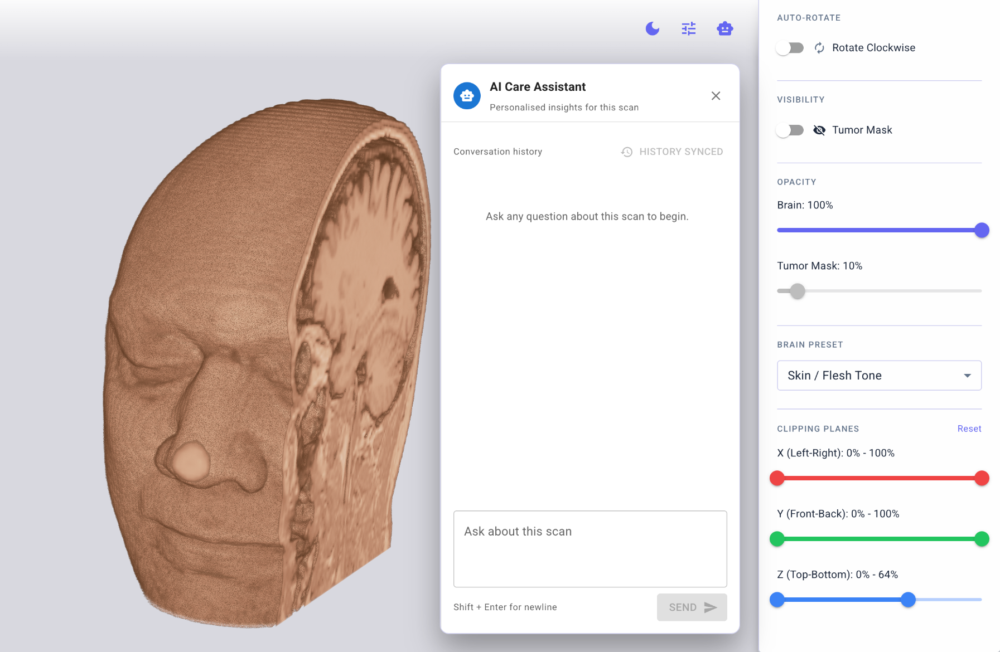
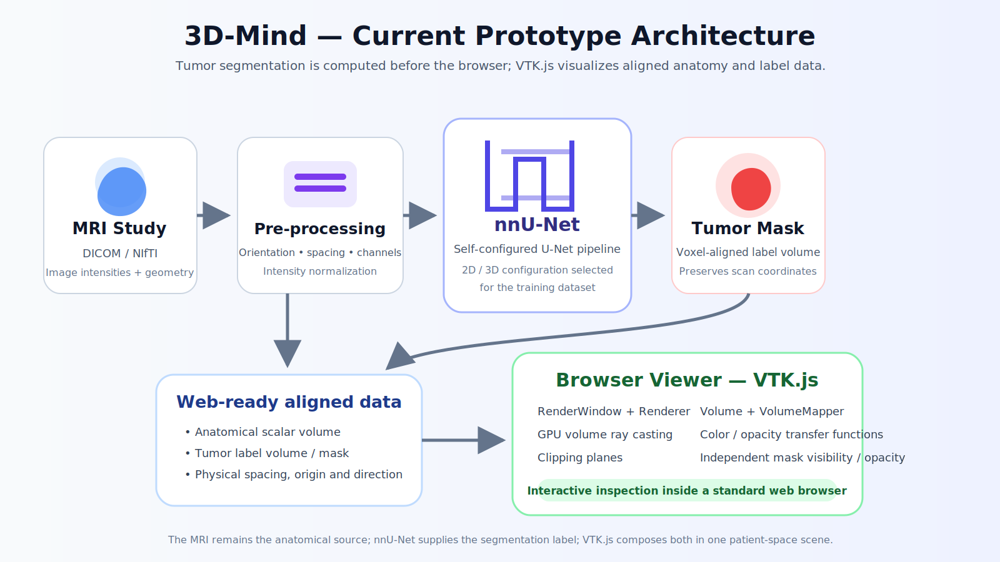
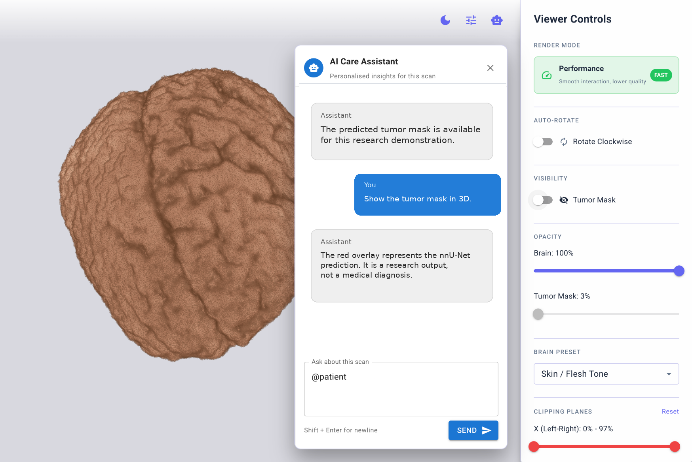
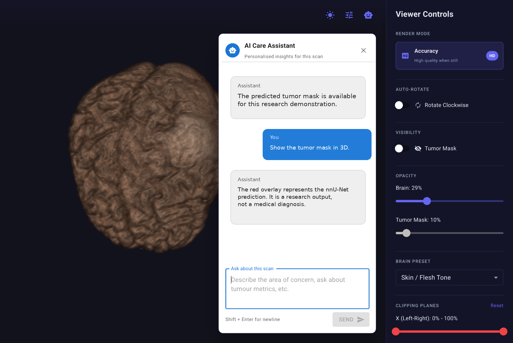
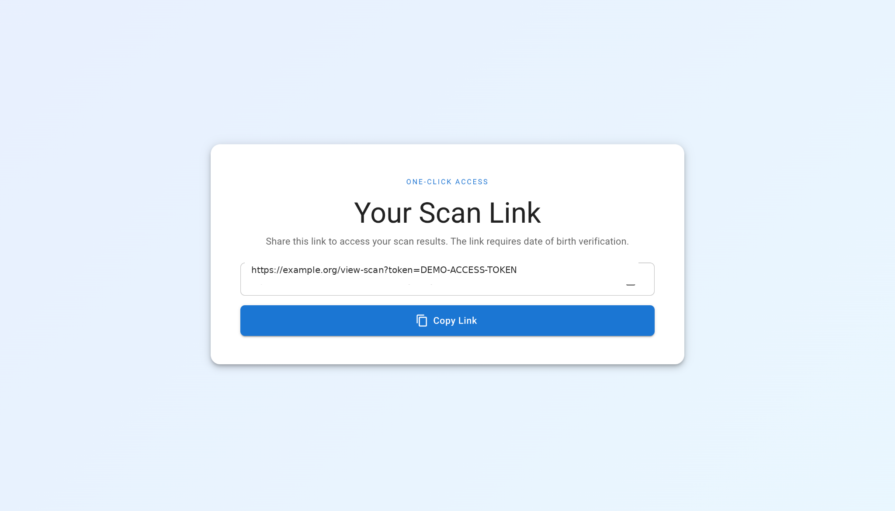

# 3D-Mind

<p align="center">
  <strong>AI-assisted brain-tumor segmentation and interactive MRI visualization in the browser</strong>
</p>

<p align="center">
  <a href="research.md"></a>
  <a href="DISCLAIMER.md"></a>
  <a href="LICENSE"></a>
</p>

<p align="center">
  
</p>

> [!WARNING]
> **3D-Mind is a portfolio and research prototype.** It is not a medical device, is not validated for diagnosis or treatment, and must not be used as a substitute for a radiologist or qualified clinician. Read the full [disclaimer](DISCLAIMER.md).

## What is 3D-Mind?

3D-Mind explores a complete idea rather than only a standalone model or viewer:

1. a brain MRI is prepared for segmentation;
2. an **nnU-Net** model predicts the tumor region as a voxel-level label mask;
3. the mask is kept spatially aligned with the MRI;
4. the anatomical volume and tumor mask are loaded into a browser scene; and
5. **VTK.js** renders the scan interactively with clipping, opacity and visibility controls.

The result is a browser-based prototype in which a user can rotate the anatomy, cut through the volume, change visual presets and inspect an AI-generated tumor segmentation in spatial context. The project also experiments with scan sharing and a contextual assistant interface, but the segmentation-to-visualization pipeline is its central contribution.

## What problem does it address?

Brain MRI is normally examined as a stack of two-dimensional slices using specialist software. That representation is precise, but it can be difficult to communicate spatially to patients, students and non-imaging collaborators. Tumor segmentation produces another volume—the label mask—but the prediction is useful only when it remains correctly registered with the original MRI and can be inspected in context.

3D-Mind connects those two parts:

- **AI segmentation** identifies the predicted tumor voxels.
- **3D scientific visualization** places those voxels inside the MRI-derived anatomy.
- **Browser delivery** removes the requirement for a desktop visualization application for this prototype experience.

The project therefore asks a practical research question:

> How can a model-generated brain-tumor mask and its source MRI be represented faithfully enough to inspect interactively in an ordinary web browser?

## Who is it built for?

3D-Mind is presented for:

- **medical-imaging and machine-learning researchers** interested in the boundary between segmentation and visualization;
- **students and technical reviewers** studying nnU-Net, volumetric rendering and browser graphics;
- **clinicians and domain experts** who want to evaluate an interaction concept, not a diagnostic product; and
- **patients or non-specialists in controlled demonstrations**, where a 3D view can support—not replace—a clinician’s explanation.

## Core contribution: tumor segmentation to browser rendering

<p align="center">
  
</p>

### 1. MRI input and geometry

An MRI is a three-dimensional scalar field. Each voxel has an intensity, but the volume also has physical geometry: voxel spacing, origin, axis direction and an affine mapping into patient space. These values matter as much as the pixels. A mask can look visually plausible while being shifted, flipped or stretched if the geometry is lost.

The prototype’s data contract is therefore conceptually:

```text
MRI = intensity volume + spacing + origin + direction/affine
Mask = integer label volume + the same physical coordinate system
```

### 2. nnU-Net tumor segmentation

3D-Mind uses an **nnU-Net model** to detect the tumor and produce a segmentation mask. nnU-Net is not one fixed, manually designed network. It is a supervised semantic-segmentation framework that analyzes a training dataset and configures a U-Net-based pipeline around properties such as dimensionality, voxel spacing, image size, anisotropy, available channels and target classes.

Depending on the dataset, nnU-Net can create and evaluate configurations such as `2d`, `3d_fullres`, and—when required for large 3D cases—a low-resolution-to-full-resolution cascade. Its preprocessing, patch size, network topology, batch size and post-processing choices are adapted from the dataset fingerprint rather than being copied unchanged between tasks.

In this project, the important output is the predicted **tumor label volume**:

```text
M(x, y, z) = 0      background
M(x, y, z) = 1..N   predicted tumor class or sub-region
```

The output mask is then associated with the MRI in the same coordinate system so that each predicted tumor voxel appears at the correct anatomical position.

Official references:

- [nnU-Net repository — MIC-DKFZ](https://github.com/MIC-DKFZ/nnUNet)
- [How nnU-Net works](https://github.com/MIC-DKFZ/nnUNet/blob/master/documentation/explanation/how-nnunet-works.md)
- [Isensee et al., *Nature Methods* (2021)](https://doi.org/10.1038/s41592-020-01008-z)

<p align="center">
  
</p>

### 3. Masking the MRI

“Masking” does not mean changing or painting over the source scan. The MRI and the model output are retained as two aligned datasets:

- the **anatomical volume** supplies intensity and spatial context;
- the **tumor mask** supplies semantic labels;
- transfer functions determine how each dataset is colored and made transparent; and
- both are transformed by the same patient-space geometry.

Keeping the mask separate is important. It allows the user to toggle the prediction, change its opacity, recolor it, compare it with the anatomy and inspect boundaries without destroying the MRI intensities.

### 4. VTK.js rendering in the browser

[VTK.js](https://kitware.github.io/vtk-js/docs/) is Kitware’s JavaScript implementation of the VTK visualization model. It is designed for scientific visualization on the web and uses GPU-backed browser graphics—principally WebGL, with evolving WebGPU support—to render image and polygonal data.

The browser rendering pipeline is summarized as:

```text
vtkImageData
   ↓
vtkVolumeMapper
   ↓
vtkVolume + vtkVolumeProperty
   ↓
vtkRenderer
   ↓
vtkRenderWindow / browser canvas
```

- **`vtkImageData`** represents the structured 3D voxel grid and its geometry.
- **`vtkVolumeMapper`** samples the volume and performs GPU volume ray casting.
- **`vtkVolumeProperty`** holds color and opacity transfer functions and interpolation settings.
- **`vtkVolume`** is the renderable object that connects the mapper and properties.
- **`vtkRenderer` and `vtkRenderWindow`** manage the camera, scene and browser output.

For each screen pixel, volume rendering conceptually traces a ray through the 3D texture, samples intensities and composites color and opacity from front to back. The user does not need to download or install native VTK; VTK.js executes the visualization pipeline within the web application.

3D-Mind uses this model to render the anatomy and tumor data as coordinated layers. The interface exposes controls that map naturally to rendering parameters: transfer-function presets, independent opacity, mask visibility, clipping ranges and adaptive render quality.

Official references:

- [VTK.js overview](https://kitware.github.io/vtk-js/docs/)
- [VTK.js volume rendering API](https://kitware.github.io/vtk-js/api/Rendering_Core_Volume.html)
- [VTK.js `VolumeMapper`](https://kitware.github.io/vtk-js/api/Rendering_Core_VolumeMapper.html)

## Prototype features

| Area | What the prototype demonstrates |
|---|---|
| Tumor segmentation | nnU-Net prediction represented as a voxel-aligned tumor mask |
| 3D visualization | Interactive brain/head rendering in a normal browser using VTK.js |
| Layer control | Independent anatomy and tumor-mask visibility and opacity |
| Clipping | X, Y and Z clipping ranges for revealing internal anatomy |
| Rendering modes | Performance-oriented interaction and a higher-quality accuracy mode |
| Transfer-function presets | Preset-based visual mapping such as a skin/flesh appearance |
| Camera interaction | Rotation, zoom, pan and optional auto-rotation |
| Contextual assistant | Prototype conversational panel for scan-related explanations and linked information |
| Share experience | One-click scan-link concept with a verification step |
| Themes | Light and dark viewer presentation |

<p align="center">
  
  
</p>

<p align="center">
  
</p>

> [!NOTE]
> The screenshots in this documentation are cropped to remove visible patient names, dates of birth and identifiers. Real medical data must be de-identified and handled under the applicable privacy, security and institutional requirements.

## How the code is divided conceptually

The exact folder names may differ in the prototype repository. This map documents the responsibilities represented by the code rather than prescribing a new development structure.

```text
3D-Mind/
├── viewer application
│   ├── scan-viewer page
│   ├── VTK.js scene and render-window setup
│   ├── anatomy and tumor volume loaders
│   ├── transfer functions, opacity and clipping controls
│   ├── performance / accuracy render behaviour
│   ├── assistant interface
│   └── scan-link and verification interface
│
├── segmentation and data preparation
│   ├── MRI channel preparation
│   ├── nnU-Net model configuration / trained weights reference
│   ├── inference output handling
│   ├── tumor-mask geometry validation
│   └── conversion to browser-readable volume assets
│
├── data and metadata
│   ├── derived anatomical volume
│   ├── predicted tumor label volume
│   └── spacing, origin, direction and display metadata
│
├── assets/                 README screenshots and diagrams
├── README.md               portfolio overview and implemented concept
├── research.md             technical basis and future research scope
├── DISCLAIMER.md           medical, AI, privacy and prototype limitations
├── ASSET_CREDITS.md        image and diagram provenance
├── NOTICE                   required license notice and contact
└── LICENSE                  PolyForm Noncommercial 1.0.0
```

## Implemented data flow

```text
MRI study
  → preserve / normalize image geometry and channels
  → nnU-Net inference
  → predicted tumor label volume
  → align prediction with MRI patient-space coordinates
  → prepare browser-readable anatomy + mask data
  → load both datasets into VTK.js
  → render and interact through the scan-viewer controls
```

This separation is deliberate: **segmentation is a machine-learning task performed before visualization; rendering is a graphics task performed in the browser.** VTK.js does not detect the tumor, and nnU-Net does not provide the interactive viewer. 3D-Mind connects the outputs and coordinate systems of both.

## Research focus: very large MRI data

A major limitation remains the size of medical-imaging studies. A single examination can include multiple sequences and hundreds or thousands of images. The stored study may be several gigabytes, while decoded voxel arrays, masks, intermediate copies and GPU textures can require even more memory than the files on disk.

The research direction is therefore not simply “compress the entire MRI and send it to the browser.” It is to preserve clinically important information while delivering only the resolution and region needed for the current view. The detailed analysis covers multiscale chunking, progressive loading, exact label handling, DICOMweb, Zarr/OME-Zarr-style storage and the possible role of Gaussian splats.

Read the complete discussion in **[research.md](research.md)**.

<p align="center">
  
</p>

## Collaboration

3D-Mind is a portfolio prototype, but research collaboration and serious technical discussion are welcome. Researchers, clinicians, medical-imaging engineers and graphics developers may contact **Yash Vyas** at **[yashvyas.ofcl@gmail.com](mailto:yashvyas.ofcl@gmail.com)** to:

- discuss the current segmentation and visualization work;
- investigate the research questions described in [research.md](research.md);
- propose a different representation or evaluation idea; or
- request coordination before preparing a repository update or research contribution.

Please do not send patient data, medical records or protected health information by email.

## License

Unless a file states otherwise, this repository is licensed under the **[PolyForm Noncommercial License 1.0.0](LICENSE)** with the required notice in [NOTICE](NOTICE). The code may be studied, reused, modified and redistributed for permitted noncommercial purposes under that license. Commercial use, incorporation into a commercial product or service, and anticipated commercial application are not permitted without a separate written license from Yash Vyas.

The repository license governs copyright and patent permissions in the supplied software. It cannot, by itself, create ownership over an abstract idea, research question or medical method. Commercial-license and collaboration inquiries may be sent to **yashvyas.ofcl@gmail.com**.

## Documentation

- [Research basis and future scope](research.md)
- [Medical and prototype disclaimer](DISCLAIMER.md)
- [Asset provenance and external visual references](ASSET_CREDITS.md)
- [Required license notice](NOTICE)
- [PolyForm Noncommercial License 1.0.0](LICENSE)

---

<p align="center">
  <strong>3D-Mind</strong><br>
  Brain-tumor segmentation with nnU-Net · Browser visualization with VTK.js<br>
  Research prototype by Yash Vyas
</p>
