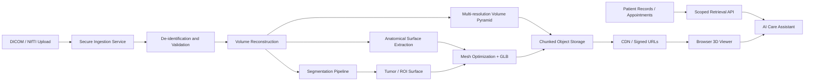
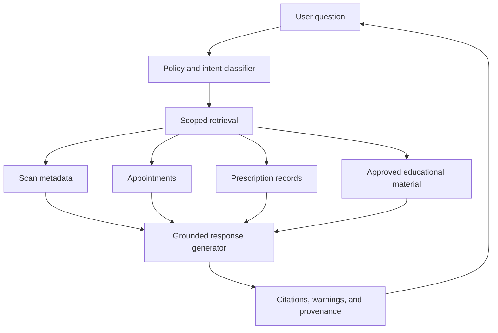

# 3D-Mind

> A browser-first platform for interactive 3D visualization of brain MRI data, tumor-mask inspection, patient-oriented scan sharing, and AI-assisted explanation of scan-related information.

<p align="center">
  
</p>

## Overview

3D-Mind explores how large medical-imaging datasets can be transformed into an accessible, interactive 3D experience that runs inside a standard web browser.

The project is designed around a practical problem: MRI examinations are usually stored as many 2D slices or as large volumetric files. These datasets can be difficult for patients to understand, inconvenient to share, and expensive to render interactively on low-power devices. 3D-Mind turns the scan into a navigable 3D representation and adds controls for visibility, clipping, opacity, render quality, tumor-mask display, secure sharing, and conversational assistance.

The current interface suggests two audiences:

- **Patients**, who need a simpler visual explanation of their scan, appointment information, prescription guidance, and a safe sharing link.
- **Clinicians, researchers, or technical reviewers**, who need spatial inspection, segmentation-mask overlays, clipping planes, adjustable opacity, and different rendering modes.

3D-Mind should be treated as a visualization and communication system, not as a replacement for radiological diagnosis or clinical judgment.

## Project Goals

The core goals are:

1. Make 3D MRI-derived anatomy viewable in a browser without specialist desktop software.
2. Allow users to inspect the model from any angle and reveal internal structures through clipping.
3. Overlay a tumor or region-of-interest mask on top of the anatomical model.
4. Support different quality/performance levels for a wide range of devices.
5. Present scan-related information through an AI care assistant in patient-friendly language.
6. Create a one-click sharing flow protected by date-of-birth verification or another lightweight access check.
7. Investigate lightweight representations for very large MRI studies, including progressive meshes, compressed volumes, sparse fields, neural representations, and Gaussian splats.

## Screenshots

### Clipped anatomical view

<p align="center">
  
</p>

This view demonstrates a reconstructed head/brain surface with a clipping plane exposing internal anatomy. The interface includes brain opacity, tumor-mask opacity, preset selection, and independent clipping ranges along the X, Y, and Z axes.

### Performance rendering mode

<p align="center">
  
</p>

Performance mode prioritizes smooth interaction and lower rendering cost. This is useful on mobile devices, integrated GPUs, or when the model has a high triangle count.

### Accuracy rendering mode and dark theme

<p align="center">
  
</p>

Accuracy mode prioritizes visual fidelity while the model is still. A practical implementation may dynamically reduce quality during interaction and restore higher quality after the camera stops moving.

### Secure scan-sharing link

<p align="center">
  
</p>

The share page generates a patient-specific link. The viewer can require date-of-birth verification before displaying scan results. For real clinical use, this mechanism should be strengthened with expiring signed tokens, access logging, revocation, and healthcare-compliant identity controls.

## Visible Features

Based on the current user interface, the project includes or targets the following capabilities.

### Interactive 3D MRI viewer

- Orbit, pan, and zoom around a reconstructed brain or head model.
- Full-browser rendering without installing a desktop medical viewer.
- Support for light and dark visual themes.
- Automatic rotation for demonstrations and patient education.

### Render modes

- **Performance mode** for fast interaction and reduced GPU cost.
- **Accuracy mode** for higher-quality rendering when the scene is stationary.
- Potential adaptive quality based on frame rate, device memory, or interaction state.

### Anatomical and tumor-mask controls

- Toggle the tumor or region-of-interest mask.
- Independently control brain and mask opacity.
- Use visual presets such as skin/flesh tone.
- Apply X, Y, and Z clipping planes to reveal internal anatomy.
- Reset clipping ranges to the full model.

### AI care assistant

- Ask questions about the scan.
- Retrieve patient-specific appointment or prescription information.
- Explain findings in simpler language.
- Maintain a conversation history.
- Provide context-aware prompts such as asking about the area of concern, tumor metrics, medication, or diet.

The assistant should clearly distinguish between information retrieved from verified records, information generated from scan metadata, and general educational content. It must not invent diagnoses, prescriptions, or treatment plans.

### Secure sharing

- Generate a one-click scan link.
- Copy the link to the clipboard.
- Require a date-of-birth check before opening the scan.
- Associate the link with a specific scan or patient identifier.

For production use, personal data should not be embedded directly in query strings. Use opaque, short-lived, revocable tokens instead.

## Problem Statement

MRI datasets are large because a scan contains many slices, multiple sequences, high bit-depth voxel values, metadata, and sometimes repeated acquisitions. A single examination may contain hundreds or thousands of DICOM files. Research datasets can grow from hundreds of megabytes to several gigabytes, and multi-sequence or longitudinal studies may exceed that.

Sending the entire raw dataset to a browser creates several problems:

- Long initial download times.
- High memory use after decompression.
- Slow conversion from slices to GPU textures or geometry.
- Browser tab crashes on low-memory devices.
- Limited GPU texture dimensions and WebGL resource limits.
- Expensive repeated processing for every user.
- Privacy risk when raw DICOM metadata is exposed client-side.

The correct architecture is therefore not “upload all DICOM files and render everything directly.” The better approach is to preprocess the study on a trusted backend, remove protected metadata, derive optimized representations, and stream only the data required for the current view.

## Medical-Imaging Theory

### DICOM

DICOM is the dominant standard for storing and exchanging medical images. An MRI study usually contains a hierarchy:

```text
Patient
└── Study
    └── Series
        └── Instances / slices
```

Each slice contains pixel data and metadata such as orientation, position, spacing, scanner parameters, sequence type, and patient information. A reconstruction pipeline must sort slices using spatial metadata rather than relying only on filenames.

### Volumetric representation

After ordering the slices, the scan can be represented as a 3D scalar field:

```text
V(x, y, z) -> intensity
```

Each voxel stores an intensity value. Unlike a normal photograph, MRI intensity is not a universal physical unit. Its appearance depends on sequence type, acquisition settings, coil behavior, preprocessing, and normalization.

Important geometric values include:

- Voxel spacing in millimetres.
- Slice thickness and inter-slice gap.
- Image orientation vectors.
- Patient-space origin.
- Affine transformation from voxel coordinates to real-world coordinates.

Ignoring these values can stretch, flip, rotate, or misalign the reconstruction.

### Segmentation mask

A tumor mask is a label volume aligned with the MRI volume:

```text
M(x, y, z) ∈ {0, 1, 2, ...}
```

For a binary mask, `0` is background and `1` is tumor. Multi-class masks may represent enhancing tumor, necrotic core, edema, ventricles, cortex, or other anatomical regions.

The mask must be stored in the same coordinate system as the MRI or transformed into it. Alignment errors are clinically dangerous because a visually convincing overlay can still be spatially wrong.

### Surface extraction

A common way to display a volume as a mesh is:

1. Normalize or threshold the volume.
2. Optionally smooth noise.
3. Extract an isosurface using Marching Cubes or a related method.
4. Remove disconnected components if appropriate.
5. Repair topology where possible.
6. Compute normals.
7. Simplify the mesh while preserving important boundaries.
8. Export to a browser-friendly format such as glTF/GLB.

For the tumor mask, an isosurface can be extracted directly from the binary or multi-label volume. The resulting mesh is usually much smaller than the full scalar volume.

### Direct volume rendering

Instead of converting the scan to a surface, the renderer can keep it as a 3D texture and perform ray marching. Each fragment samples the volume along a ray and combines intensity, opacity, and color using a transfer function.

Conceptually:

```text
pixel_color = integrate(transfer(V(ray(t))))
```

Advantages:

- Preserves interior information.
- Supports adjustable windowing and transfer functions.
- Avoids selecting a single surface threshold.

Disadvantages:

- High GPU memory use.
- Expensive sampling.
- More difficult to stream efficiently.
- Browser support depends on 3D textures, shader limits, and device capability.

A hybrid architecture is often best: use lightweight meshes for default interaction and load selected volume bricks for detailed inspection.

## Suggested System Architecture



### 1. Ingestion layer

The ingestion service accepts DICOM archives, NIfTI volumes, or approved derived formats. It should:

- Validate file type and size.
- Scan for malformed data.
- Extract study/series metadata.
- Remove or pseudonymize protected health information.
- Store original data in encrypted, access-controlled storage.
- Create an immutable processing record.

### 2. Preprocessing layer

The preprocessing pipeline should:

- Sort slices using DICOM orientation and position.
- Convert to a consistent coordinate convention.
- Resample only when necessary.
- Perform bias-field correction or denoising when justified.
- Normalize intensities by sequence.
- Generate previews and quality-control images.
- Preserve the original affine transformation.

### 3. Segmentation layer

The segmentation stage may use a validated model or externally supplied mask. It should output:

- Label volume.
- Confidence map where available.
- Connected-component information.
- Tumor volume and bounding box.
- Model version and inference parameters.
- Quality-control flags.

Any automated segmentation must be presented as an assistive result requiring expert review unless it has been validated and approved for a specific clinical use.

### 4. Geometry and volume optimization

Generate several representations from the same scan:

```text
LOD 0: tiny preview mesh
LOD 1: simplified brain and tumor meshes
LOD 2: detailed meshes
LOD 3: optional local high-resolution tiles
Volume: multi-resolution chunked pyramid
```

Recommended derived assets:

- `brain-preview.glb`
- `brain-lod1.glb`
- `brain-lod2.glb`
- `tumor.glb`
- `volume-manifest.json`
- compressed volume bricks
- thumbnail images
- scan metadata without protected identifiers

### 5. Delivery layer

Use object storage and a CDN with:

- Signed, expiring URLs.
- HTTP range requests.
- Cache-control headers for immutable derived assets.
- Gzip or Brotli for JSON and text manifests.
- Mesh compression for geometry.
- Progressive loading and cancellation.

### 6. Browser application

The browser should initially request only a small manifest and preview model. Higher-detail assets load according to:

- Camera distance.
- Current clipping region.
- User-selected render mode.
- Available GPU memory.
- Network speed.
- Whether the model is moving or stationary.

## Data-Flow Blueprint

```text
1. User uploads scan
2. Backend validates and de-identifies it
3. Slices are reconstructed into a correctly oriented volume
4. Brain and tumor regions are segmented or imported
5. Preview mesh is generated immediately
6. Detailed meshes and volume tiles are generated asynchronously
7. Assets are compressed and stored by scan ID
8. Viewer receives a signed manifest
9. Viewer loads the smallest usable representation
10. Better detail streams in progressively
11. AI assistant receives only scoped, approved context
12. Share links grant time-limited access to the selected scan
```

## Recommended Repository Structure

The exact current code layout should remain the source of truth. A scalable target structure could look like this:

```text
3D-Mind/
├── README.md
├── LICENSE
├── assets/
│   ├── scan-viewer-clipped-head.png
│   ├── scan-viewer-performance-mode.png
│   ├── scan-viewer-dark-accuracy-mode.png
│   └── secure-share-link.png
├── apps/
│   ├── web/                    # Patient and clinician browser UI
│   ├── api/                    # Auth, manifests, links, records
│   └── worker/                 # MRI preprocessing jobs
├── packages/
│   ├── viewer-core/            # Camera, clipping, materials, LOD
│   ├── medical-formats/        # DICOM/NIfTI parsing and transforms
│   ├── shared-types/           # API contracts and schemas
│   └── ui/                     # Shared components
├── pipelines/
│   ├── reconstruction/
│   ├── segmentation/
│   ├── mesh-generation/
│   ├── volume-tiling/
│   └── quality-control/
├── research/
│   ├── gaussian-splats/
│   ├── neural-fields/
│   ├── compression/
│   └── benchmarks/
├── docs/
│   ├── architecture.md
│   ├── data-model.md
│   ├── security.md
│   ├── deployment.md
│   └── research-roadmap.md
└── tests/
    ├── unit/
    ├── integration/
    ├── visual-regression/
    └── medical-geometry/
```

## Browser Rendering Strategy for 1–10 GB MRI Studies

A 1–10 GB source study should not be delivered as one browser asset. The system should create a hierarchy of derived data.

### Level 1: instant preview

- A strongly simplified GLB model.
- Small tumor mask mesh.
- Thumbnail and metadata manifest.
- Target payload: a few megabytes or less.

### Level 2: interactive diagnostic-quality geometry

- Higher-resolution surface mesh.
- Draco or Meshopt compression.
- Quantized positions and normals where error is acceptable.
- Multiple levels of detail.
- Target payload: tens of megabytes, loaded progressively.

### Level 3: localized high-resolution volume

- Divide the volume into bricks such as `32³`, `64³`, or `128³` voxels.
- Store a multi-resolution pyramid.
- Load only bricks intersecting the camera frustum or clipping region.
- Prioritize the tumor bounding box and nearby anatomy.
- Evict unused bricks with an LRU cache.

### Level 4: server-assisted rendering

For devices unable to handle the volume, render images or tiles on a GPU server and stream results. This sacrifices some client-side independence but enables access on low-end hardware.

### Compression choices

- Lossless compression for masks and clinically important labels.
- Carefully validated near-lossless or lossy compression for display-only anatomy.
- Meshopt or Draco for mesh geometry.
- KTX2/Basis Universal for compatible texture assets.
- Zstandard, Blosc, or similar chunk compression for volume bricks.
- Quantization only after measuring geometric error in millimetres.

“No losses” should be defined precisely. Bitwise lossless storage, visually lossless rendering, and clinically acceptable geometric error are different requirements.

## Research Direction: Gaussian Splats for MRI

### Is the idea related?

Yes, but only for specific outputs.

Gaussian splatting is highly relevant to fast browser rendering because a scene is represented by many anisotropic Gaussian primitives with position, scale, orientation, opacity, and appearance. Modern splat renderers can display millions of primitives interactively and can support progressive streaming.

However, standard 3D Gaussian Splatting was designed primarily for novel-view synthesis from photographs. An MRI is already a calibrated volumetric field. Converting MRI voxels into splats is possible, but it is not automatically more accurate or smaller than a well-designed sparse volume or mesh representation.

### Where splats may work well

- Smooth, fast visualization of extracted anatomical surfaces.
- Lightweight display of a segmented brain or tumor.
- Progressive level-of-detail streaming.
- Representing uncertain or soft boundaries using opacity.
- Rendering point-based structures without expensive mesh topology.
- Browser previews where photorealistic lighting is not required.

### Where splats may be a poor fit

- Exact voxel-intensity inspection.
- Quantitative measurements that must map back to the source volume.
- Slice-by-slice radiological review.
- Window/level adjustment across the original intensity distribution.
- Cases requiring guaranteed topology or watertight surfaces.
- Claims of “pinpoint accuracy” without a defined error metric.

### Better framing of the research question

Instead of asking only:

> Can MRI be converted to Gaussian splats?

Ask:

> Can a multi-resolution, segmentation-aware Gaussian representation preserve clinically relevant boundaries within a defined millimetre error while reducing browser payload, GPU memory, and time-to-first-interaction compared with meshes and chunked volume rendering?

That question is measurable and directly connected to the project.

## Proposed Lightweight MRI Splat Representation

A promising approach is not to create one splat for every voxel. That would often be too large. Use an adaptive representation.

### Step 1: separate semantics

Generate independent representations for:

- Outer anatomy.
- Brain surface.
- Tumor or ROI.
- Optional vessels, ventricles, or other structures.
- Residual interior intensity field.

### Step 2: adaptive sampling

Allocate more primitives where the signal changes rapidly:

- Tissue boundaries.
- Tumor margins.
- Thin anatomical structures.
- High-curvature areas.
- Regions with high segmentation uncertainty.

Allocate fewer primitives in homogeneous regions.

### Step 3: fit anisotropic Gaussians

For each local region, estimate:

- Mean position.
- Covariance or principal directions.
- Scale along each axis.
- Opacity.
- Intensity or feature vector.
- Semantic label.
- Confidence value.

### Step 4: preserve a reversible spatial mapping

Every primitive should map to patient-space coordinates. The viewer must be able to report position in millimetres and relate a selected splat back to the source voxel region.

### Step 5: create progressive levels

```text
Splat LOD 0: coarse anatomy preview
Splat LOD 1: whole-brain interaction
Splat LOD 2: tumor-focused detail
Splat LOD 3: local high-resolution refinement
```

### Step 6: stream by importance

Prioritize:

1. Tumor mask.
2. Brain boundary.
3. Current clipping plane.
4. Camera-near regions.
5. Remaining anatomy.

### Step 7: retain source-of-truth data

The splat representation must remain a derived visualization asset. Store the original DICOM/NIfTI and validated segmentation separately. Measurements and clinical review should refer back to the source data.

## Alternative and Complementary Research Directions

Gaussian splats should be benchmarked against several alternatives.

### Progressive meshes

Best for explicit surfaces and tumor boundaries. Mature browser support, strong compression, easy picking, and predictable geometry.

### Sparse voxel octrees

Efficient for empty space and multi-resolution traversal. Useful for large masks and sparse anatomy.

### Bricked volume rendering

Best for preserving voxel intensities. Supports progressive loading and local detail.

### Neural fields

Implicit functions can compress anatomy or intensity fields, but decoding cost and validation complexity may be high. They are promising for research but harder to trust for deterministic clinical geometry.

### Wavelet or learned compression

A multi-scale transform can reduce volume size while retaining detail. Any learned codec must be tested for boundary shifts, hallucinated structure, and sequence-specific failure.

### Hybrid representation

The most practical next-generation design is likely:

```text
Preview mesh or splats
+ precise tumor mesh
+ sparse volume bricks near the ROI
+ original source retained on the server
```

This combines fast initial interaction with high-fidelity local inspection.

## Accuracy and Validation Plan

A claim such as “pinpoint accurate with no loss” needs explicit metrics.

### Geometry metrics

- Hausdorff distance in millimetres.
- Average symmetric surface distance.
- Chamfer distance.
- Normal-angle error.
- Volume difference.
- Connected-component preservation.
- Topology changes.

### Segmentation metrics

- Dice score.
- Intersection over Union.
- Sensitivity and specificity.
- Boundary F-score.
- 95th percentile Hausdorff distance.

### Rendering metrics

- Peak signal-to-noise ratio for generated views.
- Structural similarity.
- Learned perceptual similarity for non-diagnostic preview evaluation.
- Depth error.
- Alpha/compositing error.

### System metrics

- Source size.
- Derived asset size.
- Compression ratio.
- Time to first visible model.
- Time to interactive.
- Peak CPU memory.
- Peak GPU memory.
- Average and 1% low frame rate.
- Network bytes required for a typical session.
- Mobile-device crash rate.

### Safety criteria

- No measurable tumor-boundary shift beyond the selected tolerance.
- No missing connected tumor component above a defined minimum volume.
- No coordinate-system mismatch.
- No left/right inversion.
- Clear indication when a low-detail representation is active.
- One-click access to the original 2D slices or validated viewer when required.

## Suggested Research Experiments

### Experiment A: mesh baseline

Generate several mesh LODs and measure size, speed, and boundary error.

### Experiment B: splat surface model

Fit splats to the same segmented surfaces and compare them with the mesh baseline.

### Experiment C: adaptive volumetric splats

Use more splats around tumor boundaries and fewer in uniform tissue. Compare against bricked volume rendering.

### Experiment D: hybrid model

Render coarse splats globally and high-resolution mesh/volume data around the ROI.

### Experiment E: browser benchmark

Test on:

- Desktop discrete GPU.
- Laptop integrated GPU.
- Mid-range Android device.
- iPhone/iPad-class mobile GPU.
- Slow network profile.

The output should be a reproducible benchmark table rather than only visual demonstrations.

## AI Assistant Architecture

The assistant should use retrieval rather than unrestricted generation.



Recommended safeguards:

- Retrieve only data authorized for the active patient and scan.
- Separate medical records from model-generated interpretation.
- Cite the source record inside the product.
- Refuse to invent a prescription or diagnosis.
- Escalate urgent symptoms to emergency guidance.
- Log assistant access without storing unnecessary conversational content.
- Add clinician-approved response templates for common questions.
- Display model name/version and a clear non-diagnostic notice.

## Security and Privacy

Medical imaging contains sensitive information. A production system should include:

- De-identification of DICOM headers.
- Encryption in transit and at rest.
- Role-based access control.
- Expiring and revocable share tokens.
- Audit logs.
- Rate limiting and abuse detection.
- Tenant and patient data isolation.
- Secure deletion and retention policies.
- Secret management outside source control.
- Content Security Policy and strict CORS rules.
- Prevention of identifiers in URLs, logs, analytics, and error traces.
- Regional and regulatory review appropriate to the deployment location.

Date-of-birth verification alone is not strong authentication. It may be acceptable for a prototype, but should not be the only protection for real patient data.

## API Blueprint

Illustrative endpoints:

```http
POST   /api/scans
GET    /api/scans/{scanId}
GET    /api/scans/{scanId}/manifest
GET    /api/scans/{scanId}/assets/{assetId}
POST   /api/scans/{scanId}/segmentations
GET    /api/scans/{scanId}/metrics
POST   /api/scans/{scanId}/share-links
DELETE /api/share-links/{tokenId}
POST   /api/share-links/{token}/verify
POST   /api/assistant/query
GET    /api/jobs/{jobId}
```

Example manifest:

```json
{
  "scanId": "opaque-scan-id",
  "coordinateSystem": "patient-space",
  "units": "mm",
  "preview": {
    "url": "signed-url",
    "format": "glb",
    "lod": 0
  },
  "models": [
    { "kind": "brain", "lod": 1, "url": "signed-url" },
    { "kind": "brain", "lod": 2, "url": "signed-url" },
    { "kind": "tumor", "lod": 0, "url": "signed-url" }
  ],
  "volume": {
    "enabled": true,
    "brickSize": [64, 64, 64],
    "levels": 4,
    "indexUrl": "signed-url"
  }
}
```

## Viewer Implementation Blueprint

Core modules:

```text
Viewer
├── SceneManager
├── CameraController
├── AssetLoader
├── LODManager
├── ClippingController
├── OpacityController
├── MaskController
├── RenderQualityController
├── PickingAndMeasurement
├── VolumeBrickCache
├── ThemeController
└── Telemetry
```

Important implementation details:

- Dispose GPU buffers and textures when replacing a scan.
- Cancel obsolete network requests when the camera or scan changes.
- Use workers for decompression and parsing.
- Keep the main thread free for interaction.
- Adapt pixel ratio to maintain a target frame rate.
- Use frustum and occlusion-aware loading where possible.
- Validate all transforms before rendering the mask.
- Display loading state per asset and per LOD.
- Include a visible scale and orientation marker.

## Development Roadmap

### Phase 1 — Stabilize the current prototype

- Document the existing stack and environment variables.
- Add reproducible local setup.
- Add sample de-identified data.
- Add basic tests for loading, clipping, opacity, sharing, and assistant flows.
- Remove personal identifiers from URLs and screenshots used in public documentation.

### Phase 2 — Production-ready scan pipeline

- Build secure DICOM/NIfTI ingestion.
- Add coordinate validation and de-identification.
- Automate mesh and mask generation.
- Store processing provenance.
- Add background job monitoring and failure recovery.

### Phase 3 — Progressive browser delivery

- Introduce GLB LODs.
- Add mesh compression.
- Add range-based or chunked loading.
- Add a device capability benchmark at startup.
- Implement performance and accuracy modes using measurable thresholds.

### Phase 4 — High-fidelity local volume inspection

- Build a multi-resolution volume pyramid.
- Stream only visible or ROI-adjacent bricks.
- Add slice views synchronized with the 3D camera.
- Add measurements in patient-space millimetres.

### Phase 5 — Gaussian-splat research prototype

- Build splats from a segmented surface baseline.
- Implement adaptive tumor-boundary sampling.
- Add multi-LOD splat streaming.
- Compare against mesh and brick-volume baselines.
- Publish results with reproducible metrics.

### Phase 6 — Clinical and security hardening

- Formal threat model.
- Independent privacy review.
- Clinical usability testing.
- Segmentation validation on representative datasets.
- Regulatory assessment before making diagnostic claims.

## Local Development

The exact commands depend on the repository's current package configuration. A typical modern web project would use:

```bash
git clone https://github.com/canboyedits/3D-Mind.git
cd 3D-Mind
npm install
npm run dev
```

Before publishing this section, replace the generic commands with the commands verified from the repository's actual `package.json`, backend environment, storage setup, and AI-provider configuration.

Suggested environment template:

```dotenv
# Application
APP_URL=http://localhost:5173
API_URL=http://localhost:3000

# Storage
OBJECT_STORAGE_BUCKET=
OBJECT_STORAGE_REGION=
OBJECT_STORAGE_ENDPOINT=

# Database
DATABASE_URL=

# Authentication and signing
SESSION_SECRET=
SHARE_LINK_SIGNING_SECRET=

# AI assistant
AI_API_KEY=
AI_MODEL=

# Never commit real patient data or production secrets.
```

## Testing Strategy

- Unit tests for transforms, clipping values, opacity state, and manifest parsing.
- Integration tests for upload-to-viewer processing.
- Visual regression tests for light/dark themes and clipping planes.
- Geometry tests against known synthetic volumes.
- Security tests for expired, revoked, and tampered share tokens.
- Load tests for large manifests and concurrent asset streaming.
- Browser tests across WebGL/WebGPU capability tiers.
- AI grounding tests to ensure the assistant does not fabricate records.

## Known Limitations

- A surface rendering does not preserve all information in the source MRI volume.
- Tumor masks can be incorrect or misaligned if preprocessing is faulty.
- Browser rendering quality varies by device and GPU driver.
- Date-of-birth verification is weak security when used alone.
- AI-generated explanations can be misleading without strict retrieval and provenance.
- Gaussian splats are promising for visualization, but they are not automatically lossless or clinically accurate.

## Research Hypothesis

The central next-step hypothesis for 3D-Mind is:

> A hybrid, multi-resolution representation combining lightweight global geometry or Gaussian splats with precise ROI meshes and streamed local volume bricks can reduce browser startup time and memory use while preserving clinically relevant spatial accuracy around a tumor.

This is more realistic than replacing the entire MRI with one universal representation. It also creates a clear path from prototype to measurable research.

## Contributing

Contributions are welcome in areas such as:

- Medical-image preprocessing.
- Browser rendering and WebGPU.
- Mesh and volume compression.
- Gaussian splatting and neural representations.
- Segmentation quality control.
- Accessibility and patient-centered UX.
- Security and privacy engineering.
- Benchmark design and reproducibility.

Please avoid committing real patient data. Use synthetic, public, or properly de-identified datasets with compatible licenses.

## Disclaimer

3D-Mind is a research and visualization project. It is not a certified medical device and must not be used as the sole basis for diagnosis, treatment, medication, or emergency decisions. Automated segmentations, measurements, and AI-generated explanations require review by qualified healthcare professionals.

## License

Add the repository's chosen license here. For an open-source project, verify that the license is compatible with all datasets, models, libraries, and medical-imaging components used by the system.

---

**Project:** [github.com/canboyedits/3D-Mind](https://github.com/canboyedits/3D-Mind)
