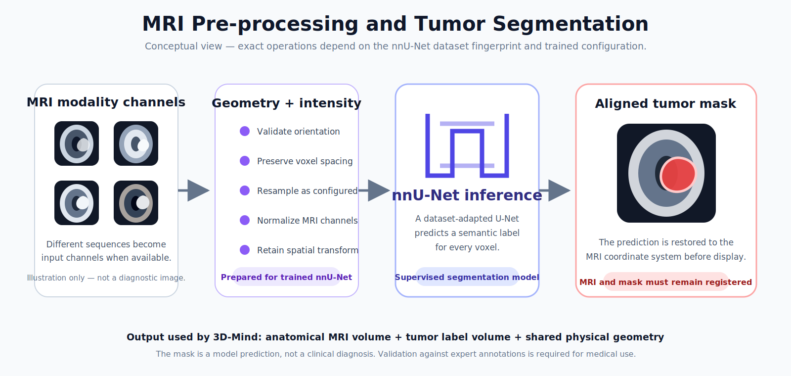
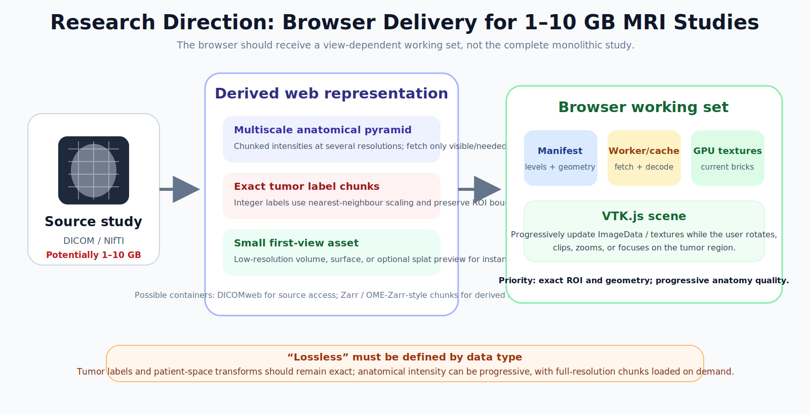
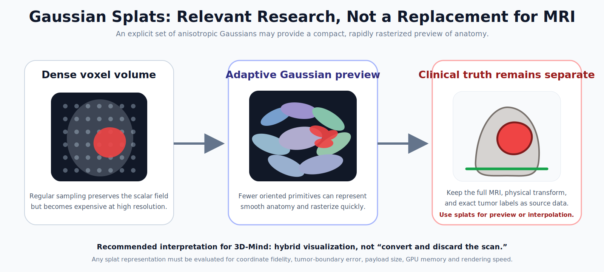

# 3D-Mind Research Notes

> **Scope of this document:** the research basis behind the existing 3D-Mind prototype and a detailed assessment of its unresolved data-representation problem. This is not an installation guide, implementation roadmap or clinical protocol.

## Research question

3D-Mind combines two mature but normally separate areas:

- **volumetric medical-image segmentation**, where a model assigns a semantic class to each voxel; and
- **interactive scientific visualization**, where an aligned scalar volume and label volume are rendered in a web browser.

The immediate prototype demonstrates that connection using **nnU-Net for brain-tumor segmentation** and **VTK.js for browser rendering**. The larger research question is:

> How can the source MRI and a precise tumor mask remain spatially faithful while being delivered and rendered interactively when a study contains gigabytes of data?

## Current research basis

### MRI as a calibrated 3D field

MRI is not merely a directory of pictures. A reconstructed series forms a three-dimensional field sampled at discrete voxel positions. Correct interpretation depends on:

- intensity values for one or more MRI sequences;
- voxel dimensions, often anisotropic;
- image origin and axis direction;
- slice position and orientation;
- ordering of slices or frames; and
- the transform between voxel indices and patient-space coordinates.

For an index vector `i = [i, j, k, 1]ᵀ`, a simplified physical mapping is:

```text
p_patient = A · i
```

where `A` is the image affine or an equivalent combination of origin, spacing and direction. The tumor mask must use the same mapping—or be transformed into it—before an overlay is meaningful.

A central research requirement of 3D-Mind is therefore **coordinate fidelity**. A visually convincing render is not sufficient if the mask has been resampled with the wrong interpolation, loaded with different axis order, or detached from its physical transform.

### MRI pre-processing for nnU-Net

nnU-Net analyzes a training dataset and records a dataset fingerprint including image dimensions, spacing, channels and target properties. It uses these properties to select or configure preprocessing and a U-Net-based architecture. The framework can handle 2D and 3D inputs and arbitrary modality channels.

For MRI, pre-processing commonly includes geometry-aware resampling and channel-wise intensity normalization. The exact target spacing, patch size, network depth, batch size and configuration are dataset dependent. This is why the project documentation should not describe nnU-Net as a single universal architecture with one fixed input size.

<p align="center">
  
</p>

The segmentation result is a discrete label field:

```text
M(x, y, z) ∈ {0, 1, …, C}
```

where each integer is background or a semantic tumor class. Because labels are categorical rather than continuous, resampling a mask should use label-safe methods such as nearest-neighbour interpolation. Linear interpolation can create invalid fractional labels and can shift thin boundaries when thresholded afterward.

### Why nnU-Net is suitable for the prototype

nnU-Net is a strong choice for a research prototype because it addresses the variability that makes medical segmentation difficult:

- datasets may be 2D or 3D;
- MRI sequences appear as different input channels;
- voxel spacing and anisotropy vary by scanner and protocol;
- targets may occupy a very small fraction of the image; and
- a network that fits into GPU memory must balance patch size, depth and batch size.

The framework creates a reproducible baseline by adapting a U-Net pipeline rather than requiring every decision to be hand-tuned. Its output is directly compatible with the 3D-Mind concept because semantic segmentation produces a volume that can be registered voxel-for-voxel with the source MRI.

Authoritative references:

1. [MIC-DKFZ nnU-Net repository](https://github.com/MIC-DKFZ/nnUNet)
2. [How nnU-Net works](https://github.com/MIC-DKFZ/nnUNet/blob/master/documentation/explanation/how-nnunet-works.md)
3. Isensee et al., [“nnU-Net: a self-configuring method for deep learning-based biomedical image segmentation”](https://doi.org/10.1038/s41592-020-01008-z), *Nature Methods*, 2021.

### Rendering research implemented with VTK.js

VTK.js brings the VTK rendering model to JavaScript. For a medical volume, the important components are:

```text
ImageData → VolumeMapper → Volume + VolumeProperty → Renderer → RenderWindow
```

`vtkImageData` represents a structured grid. `vtkVolumeMapper` accepts image data and uses GPU volume-rendering shaders. `vtkVolumeProperty` supplies opacity and color transfer functions, interpolation mode and related optical properties. The renderer and render window manage the camera and draw into the browser canvas.

#### GPU ray casting

In direct volume rendering, the GPU does not need a triangle for every voxel. For each output pixel, a ray intersects the volume bounds and samples the 3D field. A transfer function maps scalar intensity `s` to color `c(s)` and opacity `α(s)`. The samples are composited along the ray. A simplified front-to-back update is:

```text
C_new = C_old + (1 - A_old) · α_i · c_i
A_new = A_old + (1 - A_old) · α_i
```

Sampling density influences both quality and cost. Smaller sample distance captures more detail but performs more texture reads and compositing operations. A viewer can reduce quality while the camera moves and restore it when interaction stops; this explains the prototype’s performance and accuracy modes.

#### Tumor-mask rendering

The MRI and mask can be represented as separate volumes or as coordinated image layers in the same scene. The mask uses a categorical color/opacity mapping—for example, transparent background and an opaque red tumor label—while the anatomical volume uses a continuous transfer function. Both must share physical bounds and transforms.

The prototype’s opacity sliders, visibility switch and clipping controls are not cosmetic additions. They expose core volume-rendering parameters that help the user inspect whether the predicted region lies within the expected anatomy.

Authoritative references:

1. [VTK.js overview](https://kitware.github.io/vtk-js/docs/)
2. [VTK.js volume-rendering API](https://kitware.github.io/vtk-js/api/Rendering_Core_Volume.html)
3. [VTK.js `VolumeMapper`](https://kitware.github.io/vtk-js/api/Rendering_Core_VolumeMapper.html)

## The unresolved problem: study size versus browser limits

A stored MRI study and its decoded representation have different costs. Compression may make a file smaller on disk, but the browser eventually needs decoded arrays and GPU resources.

For one isotropic scalar volume using unsigned 16-bit values:

| Volume dimensions | Voxels | Raw scalar memory |
|---:|---:|---:|
| `256³` | 16.8 million | 32 MiB |
| `512³` | 134.2 million | 256 MiB |
| `768³` | 453.0 million | 864 MiB |
| `1024³` | 1.07 billion | 2 GiB |

This table covers only one scalar array. A practical viewer may also hold:

- a tumor mask;
- several MRI modalities;
- decompression buffers;
- typed-array copies;
- worker-transfer buffers;
- downsampled levels;
- GPU textures;
- temporary conversion data; and
- browser and interface memory.

A nominal 2 GiB volume can therefore exceed the memory available to a browser tab long before the study reaches 10 GB on disk. GPU texture-size limits and per-device implementation limits create further constraints. Mobile devices and integrated GPUs are especially sensitive.

### Why one compressed file is not enough

A single gzip-compressed volume improves transfer size only when the entire object is needed. It remains poorly suited to view-dependent access because the browser usually must download and decompress from the beginning before reaching arbitrary regions. Large medical viewing benefits from **randomly addressable chunks** rather than only a smaller monolithic file.

Compression also does not solve initial latency, GPU upload cost or duplicate memory. It must be part of a representation designed for partial access.

## Detailed research answer: a hierarchical, label-aware representation

The most defensible direction is a **hybrid data model** in which different information receives different precision and delivery treatment.

<p align="center">
  
</p>

### Source study remains authoritative

The original DICOM or lossless research volume remains the source of truth in trusted storage. It is not replaced by a browser asset. This preserves original intensity data, acquisition metadata and the ability to reproduce derived outputs.

The viewer receives a de-identified, display-oriented derivative. That derivative must retain enough geometry metadata to map every browser-visible coordinate back to patient space and to the source series.

### Anatomy becomes multiscale and chunked

The anatomical intensity field can be stored as a pyramid of resolutions. Each level represents the same physical volume with different sampling density:

```text
Level 0: full resolution
Level 1: approximately 1/2 resolution per selected axis
Level 2: approximately 1/4 resolution
…
```

The lowest useful level can establish the complete brain quickly. Higher-resolution chunks are fetched only where the camera, clipping planes or area of interest require them.

Chunking converts one large array into many independently compressed blocks. A request can therefore target a spatial brick rather than the whole MRI. Chunk dimensions should balance:

- HTTP and object-store request overhead;
- decompression cost;
- GPU upload granularity;
- expected view and clipping patterns; and
- cache reuse while the camera moves.

Small chunks provide precise access but create many requests and metadata entries. Large chunks reduce request count but transfer more irrelevant voxels. The optimum is an empirical systems property, not a universal number.

### Tumor labels receive stricter treatment

The label mask is usually far smaller in value range and often sparse, but its boundary has greater semantic importance than background anatomy. The mask should therefore be treated as an exact or explicitly error-bounded dataset:

- use integer label types;
- use lossless compression;
- preserve patient-space transforms;
- use nearest-neighbour resampling for label pyramids;
- give chunks intersecting the tumor higher transfer priority; and
- retain the full-resolution ROI even when the surrounding anatomy is shown at lower resolution.

A useful precision policy is:

```text
Tumor mask and transforms: exact / lossless
Anatomy near the tumor: full resolution on demand
Distant anatomy: progressive resolution
Global first view: lightweight approximation
```

This avoids the misleading promise that every visible representation is “lossless” while still protecting the information that defines the predicted tumor.

### DICOMweb as a source-access interface

DICOMweb’s WADO-RS retrieval services can request studies, series, instances, metadata, bulk data and selected frames through web protocols. This is relevant when the authoritative image archive remains DICOM-based and the application needs controlled retrieval rather than direct filesystem access.

DICOMweb alone does not automatically provide a three-dimensional multiresolution GPU-ready volume. It is best understood as a standards-based medical-image access layer. A server-side derivation service can retrieve the required series or frames, remove protected metadata, construct the volume and publish an optimized web representation.

Reference: [DICOM PS3.18 — Studies Service and WADO-RS](https://dicom.nema.org/medical/dicom/current/output/chtml/part18/chapter_10.html)

### Zarr and OME-Zarr-style derived storage

Zarr stores n-dimensional arrays as independently addressable chunks with codec-defined compression. The OME-Zarr NGFF specification adds conventions for image axes, physical coordinate transformations, multiscale datasets and integer label images. Although OME-Zarr was developed for bioimaging broadly rather than as a replacement for clinical DICOM, its data model closely matches this research problem:

- multiple resolution levels;
- spatial axes and physical units;
- explicit scale and translation transforms;
- arrays that can be hosted over HTTP or object storage; and
- label images associated with the source image.

This makes a Zarr/OME-Zarr-style derivative a strong research candidate for browser delivery, while DICOM remains the source/archive standard.

Reference: [OME-Zarr specification 0.5](https://ngff.openmicroscopy.org/0.5/)

Zarr v3 sharding can group many logical chunks inside larger shard objects, reducing object counts while preserving indexed access to internal chunks. That trade-off can matter at MRI scale, where millions of tiny objects are operationally expensive.

Reference: [Zarr v3 indexed sharding codec](https://zarr-specs.readthedocs.io/en/latest/v3/codecs/sharding-indexed/)

### Browser cache and GPU residency

The browser should maintain a bounded working set instead of accumulating everything it has ever fetched. A useful cache distinguishes:

- compressed network responses;
- decoded CPU chunks;
- chunks currently uploaded to the GPU; and
- pinned tumor/ROI chunks that should not be evicted during inspection.

Eviction can consider camera distance, current clipping planes, time since last use and whether a chunk intersects the tumor. The goal is stable memory use and predictable interaction, not merely maximum cache hit rate.

Web Workers can decode or transform data away from the interface thread. Transferable array buffers can reduce copying, although the pipeline must be designed carefully to avoid retaining both sender and receiver copies. GPU upload should be incremental so a large update does not freeze interaction.

### How this fits VTK.js

VTK.js volume rendering expects image data that can be mapped into renderable GPU resources. A conventional example loads one complete `vtkImageData` object. Very large studies require an additional streaming layer around that model:

- a manifest selects the current resolution level;
- a cache retrieves and decodes chunks;
- the application assembles or updates the active image region;
- the mapper receives only the current working set; and
- interaction quality is adjusted while data or camera state changes.

The research challenge is not only a custom file reader. It is keeping the VTK.js scene’s physical coordinates, transfer functions and clipping state stable while its underlying data becomes progressively more detailed.

Server-assisted rendering remains a fallback for devices that cannot hold a useful local working set. In that case a server renders frames from the full volume while the browser sends camera and transfer-function state. The trade-off is increased infrastructure, latency and dependence on network connectivity.

## Assessment of Gaussian splats

### Why the idea is related

3D Gaussian Splatting represents a scene with explicit anisotropic Gaussian primitives. Each primitive has a position, scale/covariance, opacity and appearance parameters; rasterization projects the Gaussians as screen-space splats and composites them efficiently. This is attractive for browser graphics because it can provide high visual detail with fast rendering and a representation that is not a dense regular grid.

Medical imaging is beginning to explore Gaussian representations for sparse-view reconstruction, interpolation, surface reconstruction and MRI super-resolution. Recent examples include:

- Park et al., [“Rendering Novel Views of MRI Using 3D Gaussian Splatting”](https://arxiv.org/abs/2606.26236), 2026;
- Liu et al., [“Physics-Driven 3D Gaussian Rendering for Zero-Shot MRI Super-Resolution”](https://arxiv.org/abs/2603.09621), 2026; and
- Marzol et al., [“MedGS: Gaussian Splatting for Multi-Modal 3D Medical Imaging”](https://arxiv.org/abs/2509.16806), 2025.

These works support the idea that Gaussian primitives can be adapted to medical scalar fields. They do not establish that a conventional photographic 3DGS pipeline can replace an MRI volume or a segmentation mask.

<p align="center">
  
</p>

### Why standard scene-generation 3DGS is not directly sufficient

Classic 3DGS is designed primarily for novel-view synthesis from posed RGB photographs. It learns view-dependent appearance and can bake lighting and acquisition characteristics into the representation. MRI is different:

- it is a calibrated volumetric scalar field, not an external photographic scene;
- every interior coordinate may matter, not only surfaces visible from training cameras;
- the viewer needs arbitrary clipping and internal inspection;
- intensity values may need quantitative interpretation;
- the tumor label is categorical and must preserve boundaries; and
- patient-space coordinates must remain explicit.

A splat representation trained only to reproduce rendered views could look convincing while moving, smoothing or omitting a small tumor boundary. Visual similarity metrics alone would not expose that failure.

Gaussian splats can also have substantial memory requirements when millions of primitives carry covariance, opacity and appearance coefficients. Their efficiency is dataset- and implementation-dependent; “splats are always smaller than voxels” is not a safe assumption.

### Most appropriate role in 3D-Mind

The strongest current interpretation is a **hybrid representation**:

```text
Authoritative MRI volume
        +
Exact nnU-Net tumor label mask
        +
Optional Gaussian-splat or lightweight surface preview
        +
On-demand full-resolution volume chunks around the ROI
```

A splat layer could provide a rapid global anatomical view while the exact mask and selected MRI chunks remain available for precise inspection. This makes the first interaction faster without claiming that a learned approximation is the medical source of truth.

A more ambitious medical Gaussian representation would attach scalar intensity, tissue/label probabilities and explicit physical coordinates to each primitive rather than only RGB appearance. Adaptive density could place more Gaussians near high gradients, thin structures and tumor boundaries. Even then, the representation should be evaluated against the original volume and mask rather than judged by screenshots.

## Research evaluation criteria

A useful representation must be assessed simultaneously as a segmentation-preservation problem and a browser-systems problem.

### Segmentation and geometry fidelity

- Dice coefficient and Intersection over Union between original and reconstructed label volumes;
- 95th-percentile Hausdorff distance;
- average symmetric surface distance;
- absolute and relative tumor-volume difference;
- connected-component preservation;
- coordinate error in millimetres at landmarks and ROI boundaries; and
- verification that orientation, spacing and origin remain correct.

### Intensity and reconstruction fidelity

- peak signal-to-noise ratio and structural similarity, with their limitations stated;
- error distributions by tissue region and distance from tumor;
- gradient/boundary preservation;
- slice consistency in axial, sagittal and coronal views; and
- error after arbitrary clipping or reslicing, not only from selected camera views.

### Browser performance

- compressed payload and metadata size;
- time to first meaningful image;
- time to first interactive rotation;
- peak browser memory and GPU memory;
- frame rate during rotation and clipping;
- time to promote an ROI from preview to full resolution;
- number and size distribution of network requests; and
- performance across desktop, integrated-GPU and mobile-class devices.

### Safety-oriented acceptance

A faster representation is not an improvement if it makes the tumor disappear, alters its topology, shifts it relative to anatomy or hides uncertainty. Any result intended for more than demonstration should make representation level and model provenance visible to the reviewer.

## Research conclusion

The existing 3D-Mind prototype demonstrates the correct conceptual separation:

- **nnU-Net** performs supervised tumor segmentation;
- the output remains an aligned **label volume**;
- **VTK.js** performs interactive rendering in the browser; and
- the source MRI remains distinct from the prediction.

The principal unresolved challenge is not the ability to draw a brain. It is the delivery of enough calibrated volumetric data to support useful interaction without exceeding browser memory, network and GPU constraints.

The most technically defensible future scope is a **progressive, multiscale, chunked and label-aware volume representation**, optionally augmented by Gaussian splats or lightweight geometry for the first view. Exact tumor labels and physical transforms should remain authoritative, while anatomical detail is streamed according to current need.

---

Return to the [main README](README.md) · Read the [disclaimer](DISCLAIMER.md) · Contact [yashvyas.ofcl@gmail.com](mailto:yashvyas.ofcl@gmail.com)
